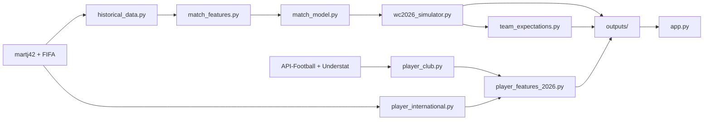

# World Cup Predictor

ML-powered **WC 2026** predictor: full-tournament Monte Carlo simulation, player awards (Golden Boot, Golden Glove, Golden Ball), and team surprise/upset vs FIFA ranking.

Built on **25,000+ international matches** (martj42, 1872–present), a Gradient Boosting match model, and a **6-tab Streamlit dashboard**.

---

## Streamlit dashboard (6 tabs)

| Tab | What it shows |
|---|---|
| **WC 2026 Winner** | Champion probabilities from full tournament sims |
| **Golden Boot** | Top scorers  -  intl form + league-difficulty-adjusted club stats × team progression |
| **Golden Glove** | Best goalkeeper  -  NT #1 + shot-stopping × team defensive path |
| **Golden Ball** | Player of the tournament  -  attack + creation × knockout depth |
| **Biggest Upset (team)** | FIFA top-20 nations rated below their ranking in sims |
| **Biggest Surprise (team)** | FIFA rank 28+ underdogs projected to punch above their weight |

---

## How predictions work

| Output | Method | Key inputs |
|---|---|---|
| WC 2026 champion | GBM match model + Monte Carlo sims | FIFA rank, form, H2H, penalties, achievements |
| Golden Boot | Composite score (not a separate `.pkl` model) | martj42 intl (2023+), club stats **2024/25 + 2025/26** with **league difficulty** (Saudi/MLS discounted), group/knockout sims |
| Golden Glove | Composite score | Primary NT GK, save %, clean sheets, team progression |
| Golden Ball | Composite score | Striker + playmaker form × team progression |
| Team upset / surprise | Sim vs FIFA expectation | Group sim + champion sim + FIFA rankings |

### WC 2026 format (simulated)

- **48 teams**, 12 groups of 4
- Top 2 per group + 8 best third-place teams → Round of 32 → final
- Groups configured in `src/config.py` (`WC2026_GROUPS`)

---

## Architecture



**Two build pipelines:**

1. **Champion**  -  `scripts/build_wc2026.py` → match features, `models/match_outcome.pkl`, champion + **group** sim CSVs (same sim count)
2. **Player awards**  -  `scripts/build_player_2026.py` → intl/club features, Boot/Glove/Ball scores, team upset/surprise (uses existing `group_simulation_2026.csv`)

---

## Project structure

```
football-predictor/
├── app.py                          # Streamlit dashboard (6 tabs)
├── config/
│   ├── api_football.json           # leagues, difficulty weights, target teams
│   └── understat_leagues.json
├── data/
│   ├── raw/                        # martj42, FIFA, club cache (mostly gitignored)
│   └── processed/                  # feature CSVs (committed for deploy)
│       ├── match_features.csv
│       ├── team_strength_2026.csv
│       ├── player_intl_2026.csv
│       ├── player_club_2026.csv
│       ├── striker_features.csv
│       ├── goalkeeper_features.csv
│       └── playmaker_features.csv
├── models/
│   └── match_outcome.pkl           # GBM used by tournament sim
├── outputs/                        # pre-built results (committed for deploy)
│   ├── wc2026_champion_probabilities.csv
│   ├── group_simulation_2026.csv
│   ├── player_tournament_2026.csv
│   ├── team_tournament_context_2026.csv
│   └── build_metadata.json
├── scripts/
│   ├── build_wc2026.py             # champion pipeline
│   ├── build_player_2026.py        # player awards + team expectations
│   └── fetch_club_stats.py         # API-Football club snapshot
└── src/
    ├── historical_data.py          # martj42 + FIFA download
    ├── match_features.py           # match-level features + ELO
    ├── match_model.py              # train match outcome GBM
    ├── wc2026_simulator.py         # full tournament MC (+ group CSV export)
    ├── wc2026_group_sim.py         # fallback group-only sim (player-only path)
    ├── player_international.py     # martj42 intl player stats
    ├── player_club.py              # club stat loader (API + Understat)
    ├── player_features_2026.py     # Boot / Glove / Ball scoring
    ├── team_expectations.py        # upset & surprise teams
    ├── league_difficulty.py        # domestic league weights
    ├── predict.py                  # helpers for app.py
    └── config.py                   # WC 2026 groups, paths, constants
```

---

## Setup (Windows)

**Python 3.12** recommended (`py -3.12`). One-time from the project folder:

```cmd
py -3.12 -m venv venv
venv\Scripts\activate
python -m pip install --upgrade pip
pip install -r requirements.txt
```

---

## Quick start (no API key)

Uses committed `data/processed/`, `models/`, and `outputs/`:

```cmd
venv\Scripts\activate
streamlit run app.py
```

---

## Full rebuild

### Complete refresh (recommended)

Champion pipeline writes **both** `wc2026_champion_probabilities.csv` and `group_simulation_2026.csv` from the **same** simulation run. Then rebuild player features (which read the group CSV **before** scoring awards):

```cmd
python scripts/build_wc2026.py --use-cache --simulations 10000
python scripts/build_player_2026.py --no-fetch-club --use-cache
```

### Champion pipeline only (~5–10 min)

```cmd
python scripts/build_wc2026.py
python scripts/build_wc2026.py --use-cache          REM reuse martj42/FIFA if fresh
python scripts/build_wc2026.py --simulations 1000   REM faster
```

Writes `outputs/wc2026_champion_probabilities.csv` and `outputs/group_simulation_2026.csv`.

### Player awards + team upset/surprise

Run **after** `build_wc2026.py` so group qualify odds match your latest sim:

```cmd
python scripts/build_player_2026.py --no-fetch-club --use-cache
```

**Player-only** (no recent champion run): force a standalone group sim first:

```cmd
python scripts/build_player_2026.py --no-fetch-club --use-cache --run-group-sim
```

### Refresh club data (optional, needs API key in `.env`)

```cmd
copy .env.example .env
python scripts/fetch_club_stats.py --force
python scripts/build_player_2026.py --no-fetch-club --use-cache
```

Club stats blend **2024/25** and **2025/26** (API seasons `2024` + `2025`). Use `--force` when adding a new season so cached JSON is refetched.

**Flags:** `--no-fetch-club` · `--fetch-club-force` · `--use-cache` · `--run-group-sim` · `--skip-sim` (skip fallback group sim if CSV missing; requires prior `build_wc2026.py`)

---

## Data sources

| Source | Role |
|---|---|
| [martj42](https://github.com/martj42/international_results) | Intl results + goalscorers (auto-download from GitHub; originally published on [Kaggle](https://www.kaggle.com/datasets/martj42/international-football-results-from-1872-to-2017)) |
| FIFA rankings API | Team strength + upset/surprise baseline |
| API-Football | Club topscorers / squads (Tier B + Big 5 fallback); seasons **2024 + 2025** |
| Understat | Big 5 xG (optional; often falls back to API); seasons **2024 + 2025** |

- martj42 / FIFA cache: **7 days** (`CACHE_TTL_DAYS`)
- Club snapshot: **long cache** (`CLUB_CACHE_TTL_DAYS`)  -  refresh when updating club seasons (`config/api_football.json`, `config/understat_leagues.json`)

---

## Built with

Python · pandas · scikit-learn · Streamlit · plotly · martj42 · API-Football
