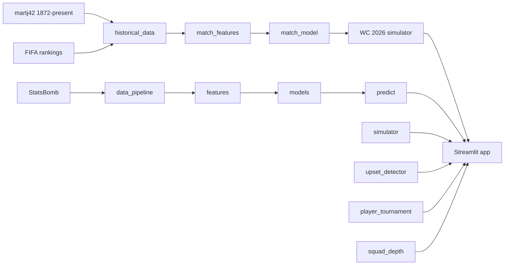

# World Cup Predictor

An ML-powered prediction system for the FIFA World Cup — forecasting **WC 2026 champion probabilities** via full-tournament Monte Carlo simulation, plus award predictions (Golden Boot, Golden Glove, Playmaker) using real football statistics.

Built on **25,000+ international matches** (martj42 dataset, 1872–present), Gradient Boosting match outcomes, StatsBomb WC data, and a Streamlit dashboard.

---

## Predictions

| Prediction | Model type | Key features |
|---|---|---|
| **WC 2026 champion** | Gradient Boosting + 5000 MC sims | FIFA rank, form, H2H, penalties, achievements, modern strength |
| Tournament winner (backtest) | XGBoost classifier | ELO rating, squad value, recent form, group difficulty |
| Golden Boot | XGBoost regressor | xG per 90, shots on target, tournament goals |
| Golden Glove | XGBoost classifier | Save %, clean sheets, PSxG vs goals allowed |
| Best Playmaker | Multi-metric ranking | xA, key passes, progressive passes, pass completion |
| Player of the Tournament | Composite score | Goals+assists, defense, creation, duel win rate |
| Group Simulator | Monte Carlo (ELO) | Probabilistic group standings (2018/2022 format) |
| Upset Detector | Logistic classifier | ELO gap, form volatility |

### WC 2026 tournament format (simulated)

- **48 teams** in 12 groups of 4 (round robin, neutral venues)
- **Top 2 per group** (24 teams) + **8 best third-place teams** → **Round of 32**
- Standard knockout bracket through the final
- Official group draw (playoffs resolved): Mexico/Czechia in A, Bosnia in B, Türkiye in D, Sweden in F, Iraq in I, Congo DR in K, etc.

---

## Architecture



---

## Project structure

```
football-predictor/
├── data/
│   ├── raw/              <- downloaded datasets (gitignored)
│   └── processed/        <- feature CSVs (committed for deploy)
├── notebooks/            <- EDA, features, modelling
├── src/
│   ├── config.py           <- WC2026 groups, martj42 URLs, round variance
│   ├── historical_data.py  <- download martj42 + FIFA + achievements
│   ├── match_features.py   <- walk-forward features from 2000+ matches
│   ├── match_model.py      <- Gradient Boosting match outcome model
│   ├── wc2026_simulator.py <- full 2026 format Monte Carlo tournament
│   ├── data_pipeline.py    <- fetch StatsBomb + historical data
│   ├── features.py         <- multi-year feature engineering
│   ├── labels.py           <- target variable extraction
│   ├── statsbomb_features.py
│   ├── models.py           <- XGBoost award models + SHAP
│   ├── predict.py          <- inference layer
│   ├── simulator.py        <- legacy group-stage sim (2018/2022)
│   ├── upset_detector.py
│   ├── player_tournament.py
│   └── squad_depth.py
├── scripts/
│   └── build_wc2026.py     <- one-command full WC 2026 pipeline
├── models/               <- trained .pkl files
├── outputs/              <- SHAP plots, rankings, champion probabilities
├── app.py                <- Streamlit dashboard (9 tabs)
├── requirements.txt
├── runtime.txt           <- Python 3.12 for Streamlit Cloud
└── setup.bat             <- Windows setup script
```

---

## Setup (Windows)

**Requires Python 3.12** (`py -3.12`)

```cmd
setup.bat
venv\Scripts\activate
```

Or manually:

```cmd
py -3.12 -m venv venv
venv\Scripts\activate
pip install -r requirements.txt
```

### WC 2026 champion pipeline (recommended)

Downloads martj42 data, builds match features, trains the match model, and runs 5000 tournament simulations (~10 min):

```cmd
python scripts/build_wc2026.py
streamlit run app.py
```

Quick run with fewer simulations:

```cmd
python scripts/build_wc2026.py --simulations 1000
```

### Award models (Golden Boot, etc.)

```cmd
python src/data_pipeline.py
python src/features.py
python src/models.py
streamlit run app.py
```

Use `--refresh` to force re-download cached data.

---

## Data sources

- **[martj42 international football](https://www.kaggle.com/datasets/martj42/international-football-results-from-1872-to-2017)** — 49,000+ results, goalscorers, shootouts, former names (auto-downloaded from GitHub)
- **FIFA rankings** — fetched from official `api.fifa.com` (men's world ranking)
- **Team achievements** — built locally from martj42 results + `WC_WINNERS` (WC/continental semi/final/win years)
- **StatsBomb open data** — event-level WC 2018 + 2022 (via `statsbombpy`) for player award models
- **FBref** — attempted via `soccerdata`; falls back to StatsBomb-derived features when blocked

---

## Model performance (backtested on 2022 WC)

| Prediction | Metric | Score |
|---|---|---|
| Tournament winner | Top-3 contains actual winner | Yes (Argentina in top 3) |
| Tournament winner | 5-fold CV accuracy | 92.3% |
| Golden Boot | MAE (goals) | 0.23 |
| Golden Boot | Mbappé prediction | 8.0 vs 9 actual |
| Golden Glove | Test accuracy | 100% (small sample) |

---

## Deploy to Streamlit Cloud

1. Push repo to GitHub (models/ and data/processed/ are committed for reliability)
2. Go to [share.streamlit.io](https://share.streamlit.io)
3. Connect repo, set main file to `app.py`
4. Python version: 3.12 (see `runtime.txt`)

---

## How I built this

- **Match outcome model** trained on 25,000+ international matches from 2000–present (friendlies, qualifiers, continental cups, World Cups)
- **Walk-forward features** — ELO, FIFA rank diff, last-5 form, head-to-head, penalty record, tournament importance weights
- **Full WC 2026 simulator** — 5000+ Monte Carlo runs through groups, play-in, pre-R16 knockout, and final
- **Modern football strength** — recency-weighted WC/continental achievements (built from martj42) + tactical squad tiers
- **Award models** use StatsBomb player events; SHAP explains winner predictions

### Limitations

- Award models (Golden Boot, etc.) still trained on 2018 + 2022 WC only
- Playoff placeholders (UEFA/FIFA intercontinental) use average strength of candidate teams
- FBref scraping may fail due to rate limits — StatsBomb fallback used

---

## Built with

Python · pandas · scikit-learn · XGBoost · SHAP · Streamlit · StatsBomb · martj42
