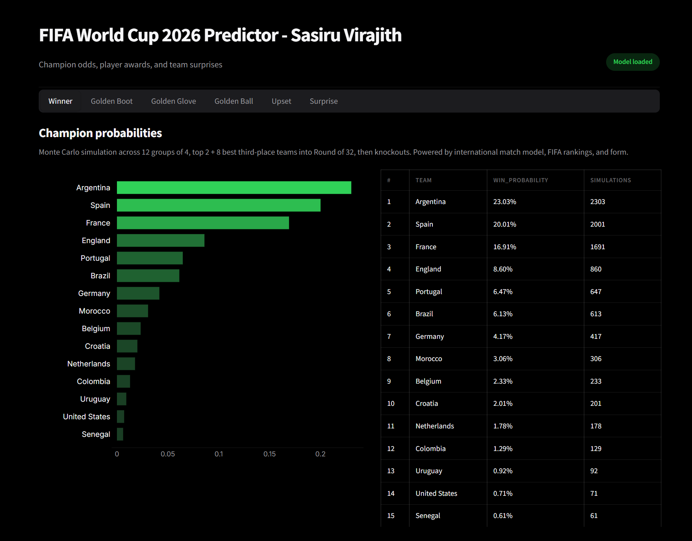
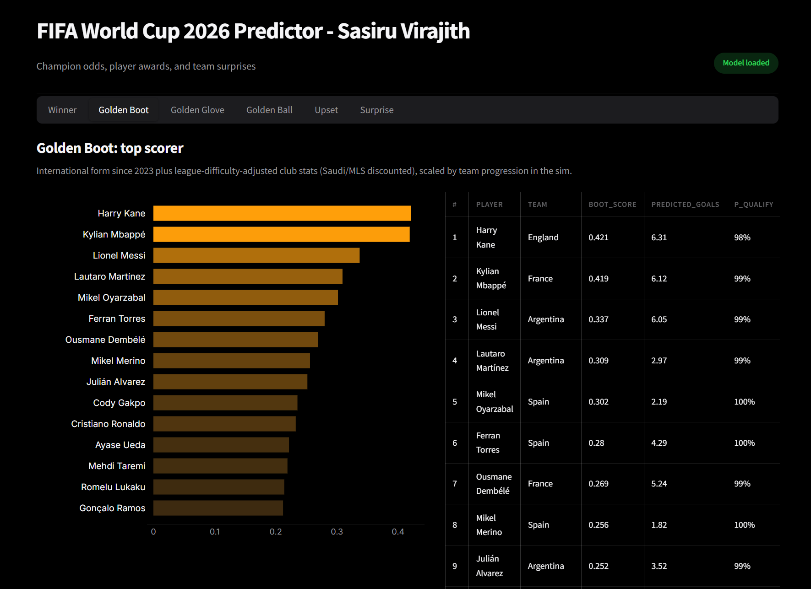
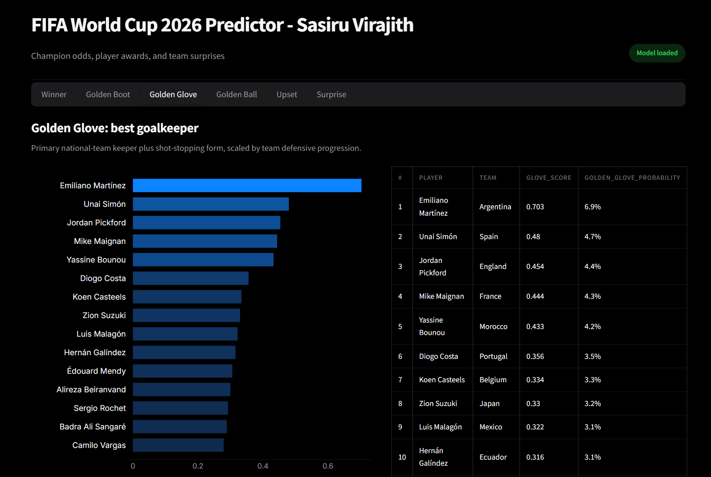
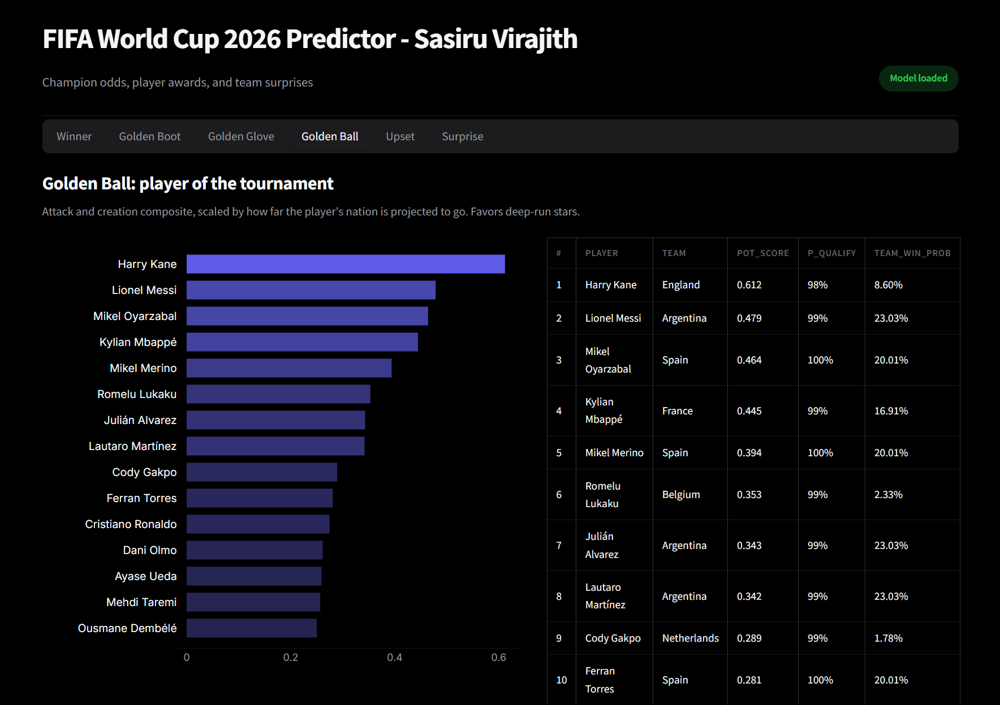
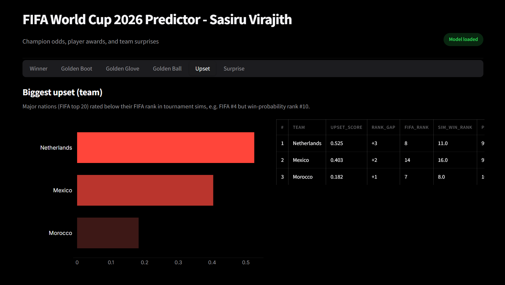
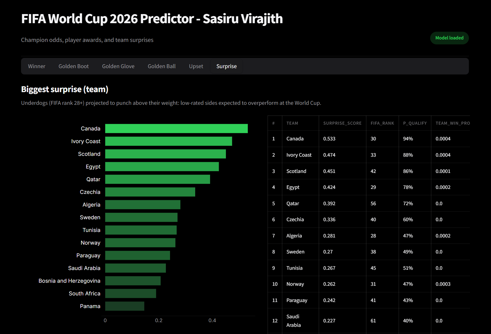
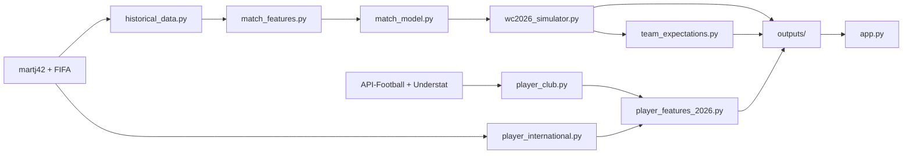

# World Cup Predictor

An ML-powered **FIFA World Cup 2026** predictor. It combines a Gradient Boosting match model trained on **25,000+ international fixtures** (martj42, 1872-present) with full-tournament Monte Carlo simulation, player award scoring (Golden Boot, Golden Glove, Golden Ball), and team-level surprise/upset analysis versus FIFA rankings.

The project ships with pre-built outputs so you can open the dashboard immediately - no API keys required for testing.

---

## What is included

| Output | Description |
|--------|-------------|
| **WC 2026 champion probabilities** | Full knockout bracket simulation (48-team format) |
| **Golden Boot ranking** | Top scorers - international form + league-adjusted club stats × team progression |
| **Golden Glove ranking** | Best goalkeeper - NT #1, shot-stopping, clean sheets × defensive team path |
| **Golden Ball ranking** | Player of the tournament - attack + creation × knockout depth |
| **Biggest upset (team)** | FIFA top-20 nations projected below their ranking in sims |
| **Biggest surprise (team)** | FIFA rank 28+ underdogs punching above their weight |

All of the above are exposed in a **6-tab Streamlit dashboard** with interactive charts and sortable tables.

---

## How it works

### Tournament simulation

1. **Historical data** - martj42 international results and goalscorers are downloaded from GitHub; FIFA rankings provide a live strength baseline.
2. **Feature engineering** - `match_features.py` builds Elo-style ratings, recent form, head-to-head, achievement history, and home-advantage signals.
3. **Match model** - A scikit-learn Gradient Boosting classifier predicts home win / draw / away win for each fixture.
4. **Monte Carlo** - `wc2026_simulator.py` plays out the official 2026 group draw thousands of times, resolves the Round of 32 (top 2 + 8 best third-place teams), and runs knockouts through the final.

Knockout rounds apply increasing score variance (group stage is relatively stable; finals are more volatile) to reflect single-elimination unpredictability.

### Player awards (composite scores, not separate ML models)

Player tabs are **rule-based composite pipelines** in `player_features_2026.py`, not additional `.pkl` models:

| Award | Key inputs |
|-------|------------|
| **Golden Boot** | martj42 international goals since 2023 (tournament-weighted), club goals/xG per 90 from **2024/25 + 2025/26**, **league difficulty** weights (e.g. Saudi Pro League discounted vs Bundesliga), expected tournament matches from group sim |
| **Golden Glove** | Primary NT goalkeeper, save %, clean sheets, goals against per 90, team defensive progression |
| **Golden Ball** | Blend of striker and playmaker scores × knockout progression factor |

Club stats come from a committed snapshot (`player_club_2026.csv`) on fresh clones. If anyone wants to, they can refresh via API-Football and Understat (Path 4). Not needed since the domestic club seasons are done for both seasons 2024/25 and 2025/26.

### WC 2026 format (simulated)

- **48 teams**, 12 groups of 4 (official draw in `src/config.py` → `WC2026_GROUPS`)
- Top 2 per group + **8 best third-place** teams → Round of 32 → final
- No playoff placeholders - all 48 slots are confirmed

---

## Streamlit Dashboard

| Tab | What it shows |
|-----|---------------|
| **WC 2026 Winner** | Champion probabilities from full tournament sims |
| **Golden Boot** | Ranked scorers with boot score and predicted tournament goals |
| **Golden Glove** | Ranked goalkeepers with glove score |
| **Golden Ball** | Ranked outfield players (attack + creation) |
| **Biggest Upset (team)** | Top-20 FIFA nations underperforming vs ranking expectation |
| **Biggest Surprise (team)** | Lower-ranked nations overperforming in sims |


---

## Predicted Winner: Argentina



**_Note:_** The bookmakers predict Spain to win, but my data driven model predicts Argentina :)

---

## Predicted Golden Boot Winner: Harry Kane (ENG)




---

## Predicted Golden Glove Winner: Emi Martínez (ARG)




---

## Predicted Golden Ball Winner: Harry Kane (ENG)




---

## Predicted Biggest Upset Team: Netherlands (NED)




---

## Predicted Biggest Surprise Team: Canada (CAN)




---

## Architecture



**Two build pipelines:**

1. **Champion** - `scripts/build_wc2026.py` → match features, `models/match_outcome.pkl`, champion + group simulation CSVs
2. **Player awards** - `scripts/build_player_2026.py` → international/club features, Boot/Glove/Ball scores, team upset/surprise (reads `group_simulation_2026.csv` from step 1)

---

## Project structure

```
football-predictor/
├── app.py                          # Streamlit dashboard (6 tabs)
├── config/
│   ├── api_football.json           # leagues, difficulty weights, target teams
│   └── understat_leagues.json      # Big 5 Understat league keys
├── data/
│   ├── raw/                        # martj42, FIFA, club cache (gitignored)
│   └── processed/                  # feature CSVs (committed for portable runs)
│       ├── match_features.csv
│       ├── team_strength_2026.csv
│       ├── player_intl_2026.csv
│       ├── player_club_2026.csv    # club snapshot (~400 rows, 2024/25 + 2025/26)
│       ├── striker_features.csv
│       ├── goalkeeper_features.csv
│       └── playmaker_features.csv
├── models/
│   └── match_outcome.pkl           # GBM used by tournament sim
├── outputs/                        # pre-built results (committed for deploy)
│   ├── wc2026_champion_probabilities.csv
│   ├── group_simulation_2026.csv
│   ├── player_tournament_2026.csv
│   ├── team_tournament_context_2026.csv
│   └── build_metadata.json
├── scripts/
│   ├── build_wc2026.py             # champion pipeline
│   ├── build_player_2026.py        # player awards + team expectations
│   └── fetch_club_stats.py         # club API fetch (maintainers)
└── src/
    ├── historical_data.py          # martj42 + FIFA download
    ├── match_features.py           # match-level features + ELO
    ├── match_model.py              # train match outcome GBM
    ├── wc2026_simulator.py         # full tournament MC (+ parallel workers)
    ├── wc2026_group_sim.py         # fallback group-only sim (player-only path)
    ├── player_international.py     # martj42 intl player stats
    ├── player_club.py              # club stat loader (API + Understat + CSV fallback)
    ├── player_features_2026.py     # Boot / Glove / Ball scoring
    ├── team_expectations.py        # upset & surprise teams
    ├── league_difficulty.py        # domestic league weights
    ├── predict.py                  # helpers for app.py
    └── config.py                   # WC 2026 groups, paths, constants
```

---

## Setup

**Python 3.12** recommended (`py -3.12`). One-time from the project folder:

```cmd
git clone https://github.com/SasiruVirajith/fifa-world-cup-2026-predictor.git
cd football-predictor
py -3.12 -m venv venv
venv\Scripts\activate
python -m pip install --upgrade pip
pip install -r requirements.txt
```

**macOS / Linux:**

```bash
python3 -m venv venv
source venv/bin/activate
pip install -r requirements.txt
```

No `.env` file is required for the paths below unless you are refreshing club data from the API (Path 4).

---

## How to run

Pick **one path** depending on how much you want to rebuild.

### Path 1 - Dashboard only

Uses committed `data/processed/`, `models/`, and `outputs/`. Fastest way to explore the app.

```cmd
venv\Scripts\activate
python -m streamlit run app.py
```

| | |
|---|---|
| **API key** | No |
| **`.env`** | No |
| **Time** | ~30 seconds |

> **Windows note:** If `streamlit run app.py` is blocked by Application Control policy, use `python -m streamlit run app.py` instead.

---

### Path 2 - Rebuild tournament sims only

Refreshes champion probabilities and group-stage Monte Carlo outputs. **Player tabs still use committed player CSVs** unless you also run Path 3.

```cmd
venv\Scripts\activate
python scripts/build_wc2026.py --use-cache --simulations 5000       #The more simulations you run, the better
python -m streamlit run app.py
```

| | |
|---|---|
| **API key** | No |
| **`.env`** | No |
| **Time** | ~1-3 min (5000 sims, parallel) |

**Useful flags:**

| Flag | Purpose |
|------|---------|
| `--workers 2` | Lower RAM on weak laptops (default caps at 4 workers) |
| `--simulations 1000` | Faster smoke test |
| Omit `--use-cache` | Force-download martj42 + FIFA on first run |

---

### Path 3 - Full rebuild: tournament + player awards (Recommended)

Run **in this order**. Uses the committed club snapshot (`player_club_2026.csv`) when raw club JSON is not present - **no API key on a fresh clone**.

```cmd
venv\Scripts\activate
python scripts/build_wc2026.py --use-cache --simulations 5000       #The more simulations you run, the better
python scripts/build_player_2026.py --no-fetch-club --use-cache
python -m streamlit run app.py
```

| | |
|---|---|
| **API key** | No |
| **`.env`** | No |
| **Time** | ~3-6 min total |

**Important:** Do **not** run `build_player_2026.py` without `--no-fetch-club` unless you have an API key configured (Path 4). Without it, a sparse in-memory fetch can produce worse player data than the committed snapshot.

---

### Path 4 - Refresh club data from API (maintainers only)

Only needed when updating **2024/25 + 2025/26** club stats from live sources. Testers on a fresh clone can skip this entirely.

```cmd
copy .env.example .env
REM Edit .env and set APIFOOTBALL_KEY=your_key_here

venv\Scripts\activate
python scripts/fetch_club_stats.py --force
python scripts/build_wc2026.py --use-cache --simulations 5000       #The more simulations you run, the better
python scripts/build_player_2026.py --no-fetch-club --use-cache
python -m streamlit run app.py
```

| | |
|---|---|
| **API key** | **Yes** (`APIFOOTBALL_KEY` in `.env`) |
| **Free tier** | ~100 requests/day on [api-football.com](https://www.api-football.com/) |

Club JSON is saved under `data/raw/club/` (gitignored). After fetching, rebuild player features, then commit updated `data/processed/player_club_2026.csv` and player feature CSVs if you want others to skip the API.

---

## Do I need an API key?

| Goal | API key? |
|------|----------|
| Open dashboard (Path 1) | No |
| Re-run 5000 tournament sims (Path 2) | No |
| Rebuild Golden Boot / Glove / Ball from clone (Path 3) | No |
| Download fresh club stats from API-Football (Path 4) | **Yes** |

---

## CLI reference

### `build_wc2026.py`

```cmd
python scripts/build_wc2026.py --use-cache --simulations 5000
python scripts/build_wc2026.py --simulations 1000 --workers 2
```

| Flag | Description |
|------|-------------|
| `--use-cache` | Skip forced re-download of martj42 / FIFA (7-day TTL) |
| `--simulations N` | Monte Carlo run count (default 5000) |
| `--workers N` | Parallel worker processes (default min(CPU, 4)) |

**Writes:** `outputs/wc2026_champion_probabilities.csv`, `outputs/group_simulation_2026.csv`, `models/match_outcome.pkl`

### `build_player_2026.py`

```cmd
python scripts/build_player_2026.py --no-fetch-club --use-cache
python scripts/build_player_2026.py --no-fetch-club --use-cache --run-group-sim
```

| Flag | Description |
|------|-------------|
| `--no-fetch-club` | Skip club HTTP fetch; use `data/raw/club/` JSON or committed `player_club_2026.csv` |
| `--fetch-club-force` | Force re-download club stats (requires API key) |
| `--use-cache` | Skip forced martj42 / FIFA re-download |
| `--run-group-sim` | Run fallback group-only sim if `group_simulation_2026.csv` is missing |
| `--skip-sim` | Do not run fallback group sim (requires prior `build_wc2026.py`) |

**Player-only refresh** (no recent champion run): use `--run-group-sim` to generate `group_simulation_2026.csv` first. Note the fallback sim qualifies top 2 per group only; the full sim in Path 2/3 also resolves best third-place teams.

---

## Troubleshooting

| Issue | Fix |
|-------|-----|
| `streamlit.exe` blocked on Windows | Use `python -m streamlit run app.py` |
| Out of memory during sims | Reduce workers: `--workers 2` |
| Golden Boot looks wrong after rebuild | Ensure `--no-fetch-club` on Path 3; check build log for `Keeping existing club snapshot` |
| `group_simulation_2026.csv` missing | Run `build_wc2026.py` first, or `build_player_2026.py --run-group-sim` |
| Club fetch skipped | Set `APIFOOTBALL_KEY` in `.env` (Path 4 only) |

---

## Data sources

| Source | Role |
|--------|------|
| [martj42](https://github.com/martj42/international_results) | International results + goalscorers (auto-download from GitHub; originally on [Kaggle](https://www.kaggle.com/datasets/martj42/international-football-results-from-1872-to-2017)) |
| FIFA rankings API | Team strength + upset/surprise baseline |
| [API-Football](https://www.api-football.com/) | Club topscorers / squads (Tier B + Big 5 fallback); seasons **2024 + 2025** |
| Understat | Big 5 xG (optional; often falls back to API); seasons **2024 + 2025** |

**Cache TTL:**

- martj42 / FIFA: **7 days** (`CACHE_TTL_DAYS`)
- Club snapshot: **long cache** (`CLUB_CACHE_TTL_DAYS`) - refresh when updating club seasons via `config/api_football.json` and `config/understat_leagues.json`

---

## Design notes

- **League difficulty** - Domestic league quality scales club and international credibility in Golden Boot scoring. Players in weaker leagues (e.g. Saudi Pro League) get a lower boot score multiplier even with strong international records; `predicted_goals` uses a separate blend and may rank them higher.
- **Name harmonization** - International data uses full names (`Harry Kane`); club API data uses short names (`H. Kane`). The pipeline merges on surname + nation when exact names differ.
- **Committed snapshots** - `player_club_2026.csv`, feature CSVs, model, and outputs are in git so Path 1 works offline after clone.

---

## Note

None of these predictions are a guarentee. At the end of the day, football has more factors than just skill and luck. This is merely a data-driven prediction. Football is not deterministic :)

---

## Built with

Python · pandas · NumPy · scikit-learn · Streamlit · Plotly · cloudscraper · martj42 · API-Football

---

## License

- MIT License: Copyright (c) 2026 Sasiru Virajith Kankanamge
- This project is intended for educational and research purposes only.
